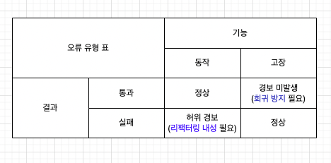

- 1장에서 살펴본 좋은 단위 테스트의 특성
  1. 개발 주기에 통합되어 있음
  2. 가장 중요한 부분만 테스트
  3. 최소한의 유지비(`가성비`)
  - 테스트가 가성비 좋으려면 가치있는 테스트를 `식별`하고, `작성`할 줄 알아야 한다고 함
  - 4장에선 가치있는 테스트를 식별하는 방법에 대해 다룸.

### 1. 좋은 단위 테스트의 4대 요소 (1,2 번째 요소)
- 회귀 방지, 리팩터링 내성, 빠른 피드백, 유지 보수성

1. 회귀 방지
   - `회귀`: 코드를 수정한 후 기능이 의도한대로 동작하지 않는 경우를 지칭
   - 코드는 자산이 아니라 책임이자 `잠재적인 버그`라고 함.
   - 테스트 중에 실행되는 코드의 양?, 코드 복잡도, 비즈니스 로직을 다루는지가 좋은 회귀 방지 지표라고 함..

2. 리팩터링 내성
   - 리팩터링한다고 해서 성공하던 테스트가 실패하면 안 됨.
   - `허위 경보`(false positive)가 많이 발생하기 시작하면 테스트 신뢰도가 떨어지게 됨. 결국 망하게 된다고 함.
     - false positive의 원인은 테스트가 `SUT의 구현 세부사항`?과 많이 결합하는 것에 비례한다고 함.. 
     
       즉, 어떻게 최종 결과가 생성되는지가 아니라 최종 결과가 올바른지만 검증하라고 함..    

- 요약하면, 회귀 방지가 어떻게든 `오류를 다 잡아내기`, 리팩터링 내성이 `애먼 코드를 오류로 잡지말기`.

### 2. 회귀 방지와 리팩터링 내성 사이의 연관성
- 회귀 방지와 리팩터링 내성 사이에 관계가 있다고 함.
- 테스트 정확도의 극대화
  - 거짓 양성과 거짓 음성이 나타날 확률이 테스트의 정확도(수준)를 나타냄! (거짓 음성: 오륜데 경보 미발생, 거짓 양성: 허위 경보)
  - **회귀 방지를 챙겨서 거짓 음성을 줄이고, 리팩터링 내성을 챙겨서 거짓 양성을 줄여 테스트 스위트의 정확도를 극대화!**  
  
  

### 3. 빠른 피드백과 유지 보수성 (3,4 번째 요소)
- 빠른 피드백: `테스트 속도가 빠를수록` 많은 테스트를 자주 수행할 수 있어서 중요.
- 유지 보수성: 이해하기 쉽고, 실행하기 쉬운 테스트를 작성하라고 함.. 

### 4. 이상적인 테스트
- 모든 코드는 책임이니, 가치의 임계치를 높이 설정하고 가치있는 테스트만 남기라고 함.
- 이상적인 테스트는 좋은 테스트의 4가지 요소를 얼마나 충족하는지로 결정.
  - 회귀 방지, 리팩터링 내성, 빠른 피드백을 모두 동시에 충족하긴 어렵다고 함.
    - 예시
      - E2E 테스트는 회귀 방지, 리팩터링 내성은 좋지만 실행이 느림.
      - 깨지기 쉬운 테스트(brittle test = 거짓 양성이 많은 = 리팩터링 내성이 낮은). 예를들어 올바른 SQL문을 생성하는지 검증하는 테스트가 깨지기 쉬움.

- `리팩터링 내성`이 좀 더 중요하다고 함... (정확히 이해 못한듯)

### 5. 대중적인 테스트 자동화? 개념
- `테스트 피라미드`: 단위 테스트, 통합 테스트 ,E2E 테스트의 비율. 
- 피라미드 상단인 E2E 테스트, 통합 테스트가 단위 테스트보다 회귀 방지에 더 유리하다고 함..
- E2E 테스트는 빠른 피드백 지표에서 낮은 점수를 받아서 너무 많으면 안 된다고 함..

- `블랙박스 테스트`와 `화이트박스 테스트`
  - 블랙박스: 내부 구조 모르고 시스템 검사?
  - 화이트박스: 애플리케이션 내부 작업을 검증. 더 철저하지만 깨지기 쉽다고 함.
  - `리팩터링 내성`은 포기할 수 없는 지표라 블랙박스 테스트를 기본으로 선택하라고 함.. 
